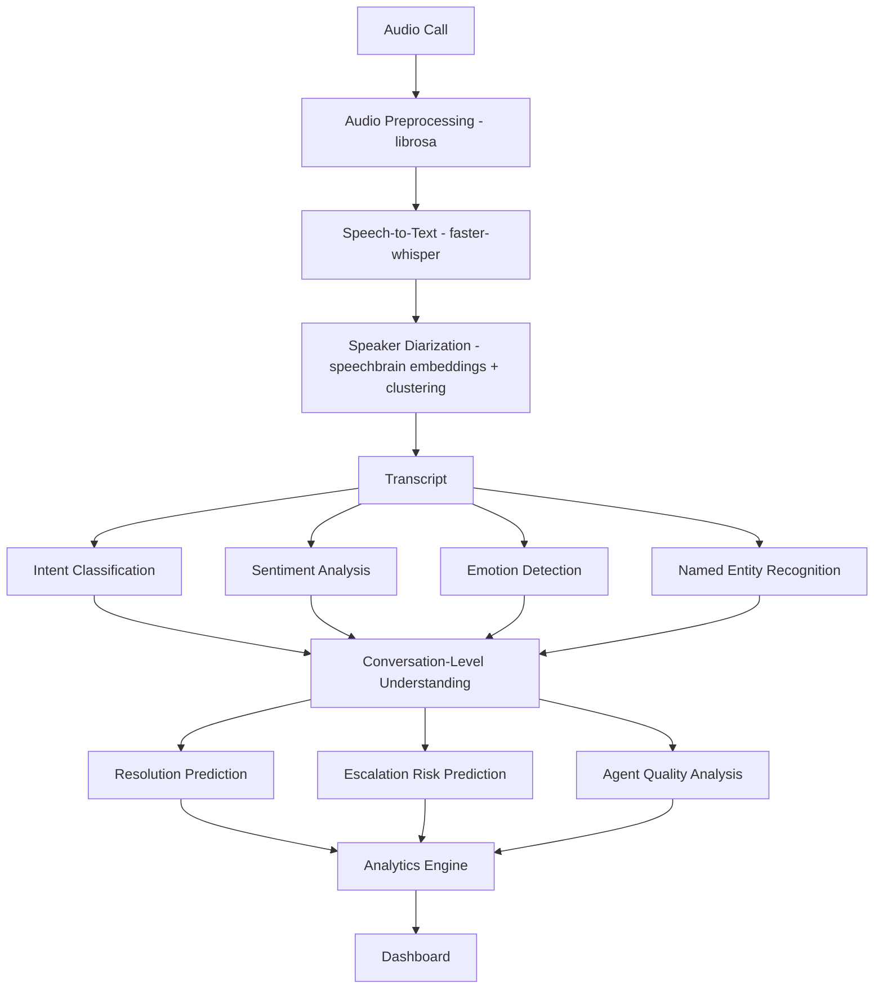
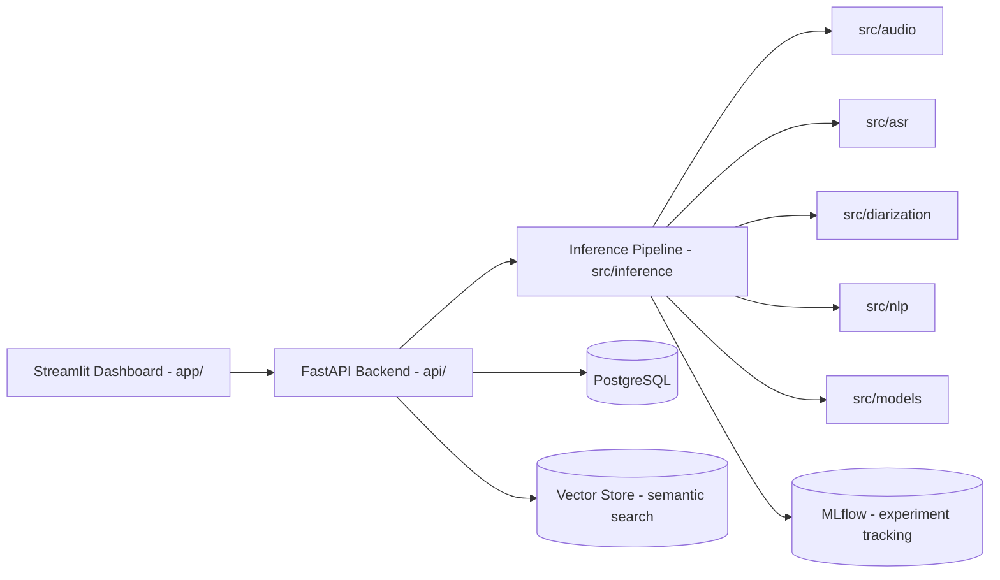

# CallSense AI — Architecture

## 1. Pipeline Architecture

Core intelligence (F–M) is Transformer-based classification/regression, fine-tuned
on task-specific data. An LLM, if used at all, sits only at an optional
summarization step after these structured predictions already exist — it is never
the thing deciding intent, sentiment, resolution, or risk.

## 2. Application Architecture

- **`app/` (Streamlit)** — thin dashboard: calls the API, renders results. No
  business logic.
- **`api/` (FastAPI)** — thin route handlers (`api/routes/`). No model code.
  Delegates all pipeline work to `src/inference`.
- **`src/inference`** — orchestrates `src/audio` → `src/asr` → `src/diarization`
  → `src/nlp` → `src/models` into one callable pipeline. This is the only place
  that composes stages; each stage module stays independently testable.
- **`src/models`** — conversation-level architectures (resolution, escalation,
  agent quality) that consume the per-utterance NLP outputs.
- **Database (PostgreSQL)** — structured storage for calls, transcripts,
  utterances, predictions, entities, agents, analytics.
- **Vector store** — embeddings for semantic conversation search (Module 8);
  concrete choice (pgvector vs. a dedicated vector DB) is made in that module.
- **MLflow** — experiment tracking and model registry for every trained model
  in `src/nlp` and `src/models`.

## 3. Data Flow

Audio/transcript upload → API validates input → `src/inference` runs ASR (if
audio) → diarization → NLP models run on the cleaned, speaker-attributed
transcript → conversation-level model aggregates per-utterance outputs →
resolution/escalation/quality/summary computed → results persisted to
PostgreSQL → analytics engine aggregates across conversations → dashboard
queries the API.

## 4. Configuration

Two layers, enforced from Module 1 onward — nothing downstream may hard-code a
path, model name, threshold, or connection string:

- **`configs/config.yaml`** — versioned, non-secret: audio parameters, model
  names, thresholds, data paths.
- **`.env`** (from `.env.example`) — per-environment/secret: DB credentials,
  API host/port, MLflow tracking URI. Loaded via `pydantic-settings`
  (`configs/settings.py`).

## 5. Technology Stack

| Layer | Choice | Why |
|---|---|---|
| Language | Python 3.13 | Standard for the ML/DL/NLP ecosystem used here. |
| DL framework | PyTorch | Native Hugging Face integration; standard for research-to-production NLP/speech. |
| NLP models | Hugging Face Transformers | Pretrained checkpoints + fine-tuning for intent/sentiment/emotion/NER (Modules 4-5). |
| ASR | faster-whisper | CTranslate2-based re-implementation of Whisper — same accuracy, several times faster and lighter on CPU, which is the default runtime target here. |
| Diarization | speechbrain ECAPA-TDNN embeddings + scikit-learn clustering | pyannote.audio's pretrained pipeline is gated (verified against the HF Hub API: `pyannote/speaker-diarization-3.1` requires an accepted-terms token this project doesn't have); speechbrain's embedding model is ungated and downloads anonymously. Full rationale and measured DER in `docs/DIARIZATION.md`. |
| Audio processing | librosa (+ soundfile) | Standard for resampling, normalization, silence trimming, feature extraction. |
| Semantic search | sentence-transformers | Standard embedding models for the Module 8 search feature. |
| Backend API | FastAPI | Async, typed, auto-documented; thin layer over `src/inference`. |
| Dashboard | Streamlit | Python-native, fastest path to an interactive analytics UI without a separate frontend stack — matches this project's ML-portfolio scope. |
| Database | PostgreSQL | Relational integrity for calls/transcripts/predictions/agents; `pgvector` extension available for Module 8 if a separate vector DB proves unnecessary. |
| Experiment tracking | MLflow | Tracks every training run's params/metrics/artifacts across Modules 4-7. |
| Containerization | Docker (+ Compose) | Reproducible local stack (API + dashboard + DB) — Module 10. |
| Testing | pytest | Unit tests per `src/` module, integration tests across pipeline stages, API tests via `TestClient`. |

## 6. Monitoring (Module 10)

Planned, not yet implemented: API latency, inference latency per pipeline
stage, transcription confidence distribution, prediction-class distribution
drift over time. Will hook into the same logger (`src/utils/logging.py`) and
MLflow instance already in place from Module 1.
