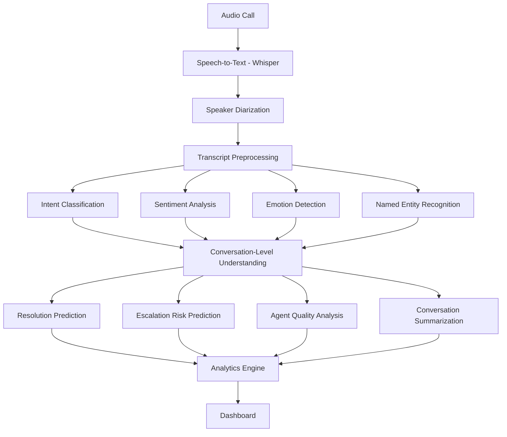
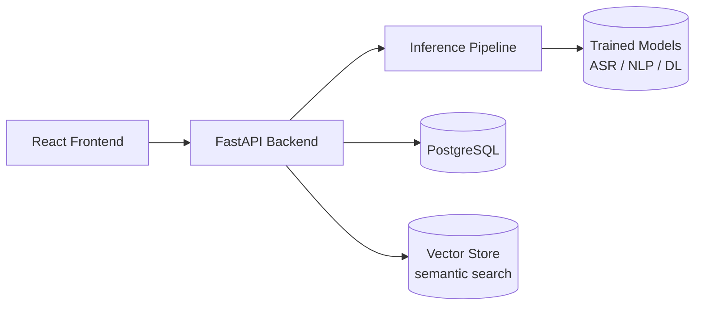

# Module 1 — Problem Definition & System Architecture

## 1. Business Problem

Customer support organizations handle large volumes of call recordings that are almost
never fully reviewed. Manual QA typically samples a small fraction of calls, which means
most customer frustration, unresolved issues, and escalation risk go unnoticed until they
show up as churn or complaints elsewhere.

CallSense AI turns raw call audio into structured, queryable conversation intelligence so
that intent, sentiment, emotion, resolution status, escalation risk, and agent performance
can be measured on every call, not a sample of them.

## 2. Users

| User | Need |
|---|---|
| Support Team Lead / QA Manager | Find conversations that need review; measure agent quality |
| Operations / CX Analyst | Track trends in complaint categories, sentiment, resolution rate |
| Support Agent | Understand their own performance feedback |
| Engineering (this project) | A modular pipeline that can be validated module-by-module |

## 3. Functional Requirements

- Accept an uploaded call recording (WAV/MP3) or a text transcript directly.
- Transcribe audio to text with timestamps (Module 4).
- Identify and label speakers as CUSTOMER / AGENT (Module 5).
- Classify the customer's intent (Module 7).
- Score sentiment and emotion, per-utterance and conversation-level (Modules 8–9).
- Extract named entities, with PII masking (Module 10).
- Predict resolution status and escalation risk (Modules 12–13).
- Score agent quality against transparent, explainable criteria (Module 14).
- Summarize the conversation (Module 15).
- Support semantic search across historical conversations (Module 16).
- Expose all of the above through a REST API (Module 19) and a dashboard (Module 18).

## 4. Non-Functional Requirements

- **Modularity**: every ML/DL component must be trainable, testable, and evaluable in
  isolation before integration (see per-module folder structure below).
- **Explainability**: risk and quality scores must expose the structured signals that
  produced them, not just a number.
- **Privacy**: PII must be detected and maskable before storage or display; no raw
  customer audio/text from production is used in development — only public/synthetic data.
- **Reproducibility**: fixed random seeds, versioned models, tracked experiments.
- **Extensibility**: new intents/entities/languages should not require re-architecting
  the pipeline.

## 5. Input / Output Specification

**Input**: a call recording (`.wav`/`.mp3`) or a pre-existing transcript (JSON/text).

**Output** (per conversation):

```json
{
  "conversation_id": "string",
  "transcript": [{"start": 0.0, "end": 6.2, "speaker": "CUSTOMER", "text": "..."}],
  "intent": "Billing",
  "sentiment": {"per_utterance": [...], "overall": "Negative"},
  "emotion_timeline": [{"t": 25, "label": "Frustrated"}],
  "entities": [{"type": "ORDER_ID", "value": "45821"}],
  "resolution_status": "Unresolved",
  "escalation_risk": {"score": 0.87, "reasons": ["Repeated complaint", "Negative sentiment"]},
  "agent_quality_score": 72,
  "summary": "..."
}
```

## 6. End-to-End Architecture



## 7. Application Architecture



- **Frontend**: React (chosen over the originally-sketched Streamlit option so the UI can
  evolve into a real product surface — dashboard, call analysis, risk view, agent
  analytics, search, reports).
- **Backend**: FastAPI, exposing the REST endpoints defined in Module 19.
- **Inference pipeline**: separated from API route handlers — reusable inference classes
  per model, so training/inference code never lives inside `app.py` (Module 21).
- **Database**: PostgreSQL for structured data (Module 20); a vector store for semantic
  search embeddings (Module 16).

## 8. Data Flow

Audio/transcript upload → API validates input → inference pipeline runs ASR (if audio) →
diarization → NLP models run in parallel on the cleaned transcript → conversation-level
model aggregates per-utterance outputs → resolution/escalation/quality/summary computed →
results persisted to Postgres → analytics engine aggregates across conversations →
dashboard queries the API.

## 9. Repository Structure

```text
CallSense AI/
├── backend/          # FastAPI app + inference pipeline (Modules 19, 21)
├── frontend/          # React dashboard (Module 18)
├── ml/                # Training code, notebooks, experiments (Modules 3-17, 27-28)
│   ├── data/
│   ├── notebooks/
│   └── src/
├── models/            # Saved model artifacts (git-ignored, versioned separately)
├── tests/             # Unit / integration / API / model tests (Module 22)
└── docs/              # Module-by-module documentation (this file is Module 1)
```

## 10. MVP / Advanced / Production Scope

| Tier | Scope |
|---|---|
| **MVP** | Text-transcript input only (skip ASR/diarization). Baseline intent + sentiment (TF-IDF + Logistic Regression). Single-page dashboard showing per-conversation results. |
| **Advanced** | Full audio pipeline (Whisper + diarization). Transformer models for intent/sentiment/emotion/NER. Resolution + escalation prediction. Full dashboard with search. |
| **Production** | Dockerized services, PostgreSQL + vector store, monitoring (latency, drift), experiment tracking (MLflow), authentication, PII masking enforced end-to-end. |

## 11. Status

This module defines scope and architecture only — no modeling decisions are finalized
yet. Module 2 (dataset research) is the next step and must be completed before any model
training begins.
